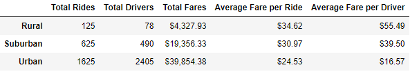

# PyBer_Analysis

## Overview of the Analysis
In this project I combined two data spreadsheets to analyze ride data across a variety of cities. I spliced two datasets together, the city_data and ride_data spreadsheets, with the help of Python to reach the solutions asked for in the prompt. In this analysis, I looked at ride counts per city type, average cost per ride in each city type, average fare per person/driver, and cummulative fares by city type. In general, "Urban" cities tended to bring in more money because they had more people, while "Rural" cities had less total fare because of their smaller population sizes. In the results to come, I will specifically state the findings for each of these results.

## Results

## Summary
