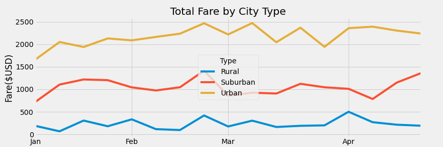

# PyBer_Analysis

## Overview of the Analysis
In this project I combined two data spreadsheets to analyze ride data across a variety of cities. I spliced two datasets together, the city_data and ride_data spreadsheets, with the help of Python to reach the solutions asked for in the prompt. In this analysis, I looked at ride counts per city type, average cost per ride in each city type, average fare per person/driver, and cummulative fares by city type. In general, "Urban" cities tended to bring in more money because they had more people, while "Rural" cities had less total fare because of their smaller population sizes. In the results to come, I will specifically state the findings for each of these results.

## Results
Using Python, I was able to create a table displaying the total rides, drivers, profits, and costs among the three major city types. From the data, we can see that the total number of rides in "Urban" cities amounts to 1,625 rides, while the total number of rides in the "Rural" was only 125. The total number of drivers in the "Urban" was also significantly higher than the amount in "Suburban" or "Rural" areas.  However, because of the lack of drivers in the less populated "Rural" and "Suburban" areas, the prices tended to be much higher in these areas because there were less people. The results of these findings are more specifically illustrated in the figure I developed below from the dataset.

## Summary
